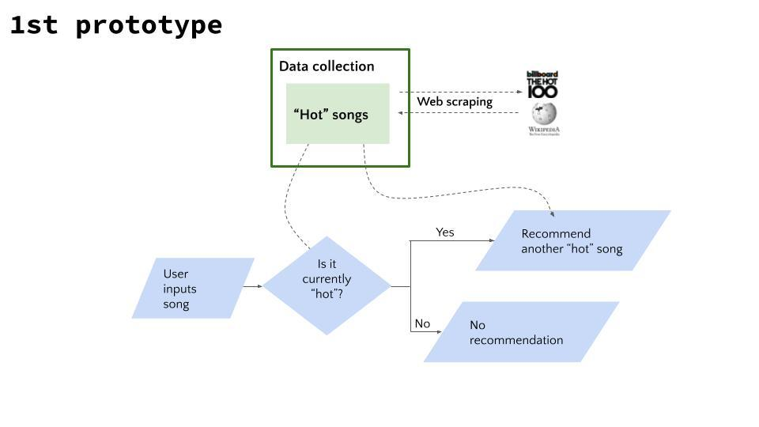

# Case study of the week: GNOD
Project from DA Bootcamp Ironhack, team Karina and Sam

Hooray! You have been hired as a Data Analyst for **Gnod!**

Gnod is a site that provides recommendations for music, art, 
literature and products based on collaborative filtering algorithms. 
Their flagship product is the music recommender, which you can try at [www.gnoosic.com](http://www.gnoosic.com/).
 The site asks users to input 3 bands they like, and computes similarity
 scores with the rest of the users. Then, they recommend to the user 
bands that users with similar tastes have picked.

Gnod is a small company, and its only revenue stream so far are adds 
in the site. In the future, they would like to explore partnership 
options with music apps (such as Deezer, Soundcloud or even Apple Music 
and Spotify). But for that to be possible, they need to expand and 
improve their recommendations.

That’s precisely where you come. They have hired you as a Data 
Analyst, and they expect you to bring a mix of technical expertise and 
business mindset to the table.

Jane, CTO of Gnod, has sent you an email assigning you with your first task.

## **The Challenge**

This is an e-mail Jane - CTO of Gnod - sent over your inbox in the first weeks working there.

> Dear xxxxxxxx,
We are thrilled to welcome you as a Data Analyst for Gnoosic!
As you know, we are trying to come up with ways to enhance our music recommendations. One of the new features we'd like to research is to recommend songs (not only bands). We're also aware of the limitations of our collaborative filtering algorithms, and would like to give users two new possibilities when searching for recommendations:
- Songs that are actually similar to the ones they picked from an acoustic point of view.
- Songs that are popular around the world right now, independently from their tastes.
Coming up with the perfect song recommender will take us months - no need to stress out too much. In this first week, we want you to explore new data sources for songs. The internet is full of information and our first step is to acquire it do an initial exploration. Feel free to use APIs or directly scrape the web to collect as much information as possible from popular songs. Eventually, we'll need to collect data from millions of songs, but we can start with a few hundreds or thousands from each source and see if the collected features are useful.
Once the data is collected, we want you to create clusters of songs that are similar to each other. The idea is that if a user inputs a song from one group, we'll prioritize giving them recommendations of songs from that same group.
**On Friday**, you will present your work to me and Marek, the CEO and founder. Full disclosure: I need you to be very convincing about this whole song-recommender, as this has been my personal push and the main reason we hired you for!
Be open minded about this process: we are agile, and that means that we define our products and features on-the-go, while exploring the tools and the data that's available to us. We'd love you to provide your own vision of the product and the next steps to be taken.
Lots of luck and strength for this first week with us!
Jane

Have fun and enjoy the ride!

## Introduction to webscraping (Monday's lab)

### lesson overview

To conduct analysis, sometimes the data is not readily available as structured files such as `.csv`, `.xls`, `.txt`, etc. In some instances, we need to extract information from different websites, webpages, and other online content. This is accomplished through **webscraping** by using different tools/libraries available in Python such as *Beautiful Soup*, *Selenium*, and *Scrapy*. The content extracted mostly is either HTML or a JSON file. In this lesson, we will learn how to read, understand and use HTML content. We will introduce the Beautiful Soup library and check a simple implementation to extract web information using Python.

### learning goals

- Introduction to the GNOD case study this week

    You have been hired as a Data Analyst for **Gnod.**

    Gnod is a site that provides recommendations for music, art, 
    literature and products based on collaborative filtering algorithms. 
    Their flagship product is the music recommender, which you can try at [www.gnoosic.com](http://www.gnoosic.com/).
     The site asks users to input 3 bands they like, and computes similarity
     scores with the rest of the users. Then, they recommend to the user 
    bands that users with similar tastes have picked.

    Gnod is a small company, and its only revenue stream so far are adds 
    in the site. In the future, they would like to explore partnership 
    options with music apps (such as Deezer, Soundcloud or even Apple Music 
    and Spotify). But for that to be possible, they need to expand and 
    improve their recommendations.

    That’s precisely where you come. They have hired you as a Data 
    Analyst, and they expect you to bring a mix of technical expertise and 
    business mindset to the table.

    Jane, CTO of Gnod, has sent you an email assigning you with your first task.

    ## **The Challenge**

    This is an e-mail Jane - CTO of Gnod - sent over your inbox in the first weeks working there.

    > Dear xxxxxxxx,
    We are thrilled to welcome you as a Data Analyst for Gnoosic!
    As you know, we are trying to come up with ways to enhance our music recommendations. One of the new features we'd like to research is to recommend songs (not only bands). We're also aware of the limitations of our collaborative filtering algorithms, and would like to give users two new possibilities when searching for recommendations:
    - Songs that are actually similar to the ones they picked from an acoustic point of view.
    - Songs that are popular around the world right now, independently from their tastes.
    Coming up with the perfect song recommender will take us months - no need to stress out too much. In this first week, we want you to explore new data sources for songs. The internet is full of information and our first step is to acquire it do an initial exploration. Feel free to use APIs or directly scrape the web to collect as much information as possible from popular songs. Eventually, we'll need to collect data from millions of songs, but we can start with a few hundreds or thousands from each source and see if the collected features are useful.
    Once the data is collected, we want you to create clusters of songs that are similar to each other. The idea is that if a user inputs a song from one group, we'll prioritize giving them recommendations of songs from that same group.
    **On Friday**, you will present your work to me and Marek, the CEO and founder. Full disclosure: I need you to be very convincing about this whole song-recommender, as this has been my personal push and the main reason we hired you for!
    Be open minded about this process: we are agile, and that means that we define our products and features on-the-go, while exploring the tools and the data that's available to us. We'd love you to provide your own vision of the product and the next steps to be taken.
    Lots of luck and strength for this first week with us!
    Jane

    Have fun and enjoy the ride!

- Understand the basics of HTML (structure, tags, classes...)
- Locate data in the HTML code of a website using Chrome Inspect
- Extract information from a basic web page using Beautiful Soup

### Additional resources

- [Use cases of webscraping](https://www.captaindata.co/blog/11-reasons-why-use-web-scraping)
- [Understand HTML content](https://developer.mozilla.org/en-US/docs/Learn/Getting_started_with_the_web/HTML_basics)
- [HTML Basics](https://html.com/)
- [Beautiful Soup, Scrapy and Selenium](https://medium.com/analytics-vidhya/scrapy-vs-selenium-vs-beautiful-soup-for-web-scraping-24008b6c87b8)

    [dormouse.html](https://s3-us-west-2.amazonaws.com/secure.notion-static.com/50cdc534-3ba0-4912-845c-0bb2d3ae8629/dormouse.html)

    [code.html](https://s3-us-west-2.amazonaws.com/secure.notion-static.com/7b2206d0-0f1b-4b85-9a77-cb5327cc697a/code.html)

    [8_01_intro_to_webscraping.ipynb.zip](https://s3-us-west-2.amazonaws.com/secure.notion-static.com/165c7f43-770a-4177-8016-239b7cb7d667/8_01_intro_to_webscraping.ipynb.zip)

## Scraping many pages (Tuesday's lab)

In the previous lesson, we introduced web scraping, and we explained why is it important and how it is performed using Beautiful Soup library in Python. In this lesson, we will dive deeper into application of Beautiful Soup and learn how to accomplish more complex task of scraping multiple pages from the Internet. We will also talk about some advanced features/functions such as `sleep()` function to make the Python scraping script more robust.

### Learning Objectives

By the end of this lesson, you will be able to:

- Engage in a complex web scraping task involving the scraping of multiple pages

### Additional Resources

If you would like to study these concepts before the class or would 
benefit from some remedial studying, please utilize the resources below:

- [Using Beautiful Soup - external resource 1](https://codeburst.io/web-scraping-101-with-python-beautiful-soup-bb617be1f486)
- [Using Beautiful Soup - external resource 2](https://www.learndatasci.com/tutorials/ultimate-guide-web-scraping-w-python-requests-and-beautifulsoup/)

[8_02_multiple_page_scraping-WIP.ipynb.zip](https://s3-us-west-2.amazonaws.com/secure.notion-static.com/5177d5f3-861d-4b15-8d39-5d03d69119d3/8_02_multiple_page_scraping-WIP.ipynb.zip)

[8.03_first_prototype.ipynb.zip](https://s3-us-west-2.amazonaws.com/secure.notion-static.com/3a5d4306-72ee-4f2a-ba2a-45163a6938aa/8.03_first_prototype.ipynb.zip)

## API Wrappers

As discussed before, APIs provide an interface between applications governed by a set of rules/protocols to extract. In this lesson, we use `Spotify` API to extract some relevant information for our business case. API wrappers facilitate using an API by simplifying their access for the  users. Using Python we can create our own libraries that abstract the way we communicate with the API. In this lesson we use `SpotiPy` as an example to learn how to use API wrappers.

### Learning Objectives

By the end of this lesson, you will be able to:

- Apply API Wrappers
- Utilize `SpotiPy` library to get the artists, albums, and songs from the `Spotify` API

### Additional Resources

If you would like to study these concepts before the class or would 
benefit from some remedial studying, please utilize the resources below:

- [What is an API Wrapper](https://www.reddit.com/r/explainlikeimfive/comments/4ujkcx/eli5_what_is_an_api_wrapper/)
- [Python API Wrappers](https://towardsdatascience.com/how-to-get-data-from-apis-with-python-dfb83fdc5b5b)
- [Using SpotiPy](https://morioh.com/p/31b8a607b2b0)

## Lab | API wrappers - Create your collection of songs & audio features (Wednesday's lab)
Instructions
To move forward with the project, you need to create a collection of songs with their audio features - as large as possible!

These are the songs that we will cluster. And, later, when the user inputs a song, we will find the cluster to which the song belongs and recommend a song from the same cluster. The more songs you have, the more accurate and diverse recommendations you'll be able to give. Although... you might want to make sure the collected songs are "curated" in a certain way. Try to find playlists of songs that are diverse, but also that meet certain standards.

The process of sending hundreds or thousands of requests can take some time - it's normal if you have to wait a few minutes (or, if you're ambitious, even hours) to get all the data you need.

An idea for collecting as many songs as possible is to start with all the songs of a big, diverse playlist and then go to every artist present in the playlist and grab every song of every album of that artist. The amount of songs you'll be collecting per playlist will grow exponentially!

## Spotify
### Features
Audio Features & Analysis  

Explore audio features and in-depth audio analysis of tracks 
With the Spotify Developer Platform, you’re able to read calculated audio features of tracks to learn about its danceability, energy, valence, and more. For more advanced use cases, it is possible to read in-depth analysis data about tracks such as the segments, tatums, bars, beats, pitches, and more. 

Mood: Danceability, Valence, Energy, Tempo 
Properties: Loudness, Speechiness, Instrumentalness 
Context: Liveness, Acousticness 
Segments, Tatums, Bars, Beats, Pitches, Timbre, and more 

### Object Index / AlbumObject
- popularity
The popularity of the album. The value will be between 0 and 100, with 100 being the most popular. The popularity is calculated from the popularity of the album’s individual tracks.	Integer
- genres
A list of the genres the artist is associated with. For example: "Prog Rock" , "Post-Grunge". (If not yet classified, the array is empty.)	Array[String]
- type
The object type: "artist"	String
- uri
The Spotify URI for the artist.	String
- artists
The artists of the album. Each artist object includes a link in href to more detailed information about the artist.	Array[ArtistObject]
- tracks
The tracks of the album.	Array[SimplifiedTrackObject]
